# Push-Benachrichtigungen — DEMOCRACY App

> Technische Dokumentation des Push-Notification-Systems der DEMOCRACY-App.
> Alle Benachrichtigungen werden über native APNs (iOS) und FCM (Android) Tokens ausgeliefert — **nicht** über Expo Push Tokens. Das Backend stellt die Zustellung direkt sicher.

---

## Inhaltsverzeichnis

1. [Übersicht](#1-übersicht)
2. [Architektur](#2-architektur)
3. [Berechtigungen](#3-berechtigungen)
4. [Token-Registrierung](#4-token-registrierung)
5. [Benachrichtigungskategorien](#5-benachrichtigungskategorien)
6. [Deep-Link-Routing](#6-deep-link-routing)
7. [Benachrichtigungseinstellungen](#7-benachrichtigungseinstellungen)
8. [UI-Komponenten](#8-ui-komponenten)
9. [Dateistruktur](#9-dateistruktur)
10. [Konfiguration](#10-konfiguration)
11. [Testing](#11-testing)

---

## 1. Übersicht

Die DEMOCRACY-App nutzt Push-Benachrichtigungen, um Bürgerinnen und Bürger über aktuelle Vorgänge im Bundestag zu informieren. Das System basiert auf **Expo Notifications** mit nativen Geräte-Tokens:

- **iOS**: Apple Push Notification Service (APNs)
- **Android**: Firebase Cloud Messaging (FCM)

Das Backend erhält den nativen Geräte-Token direkt und versendet Benachrichtigungen ohne den Umweg über den Expo Push Service.

### Systemkontext

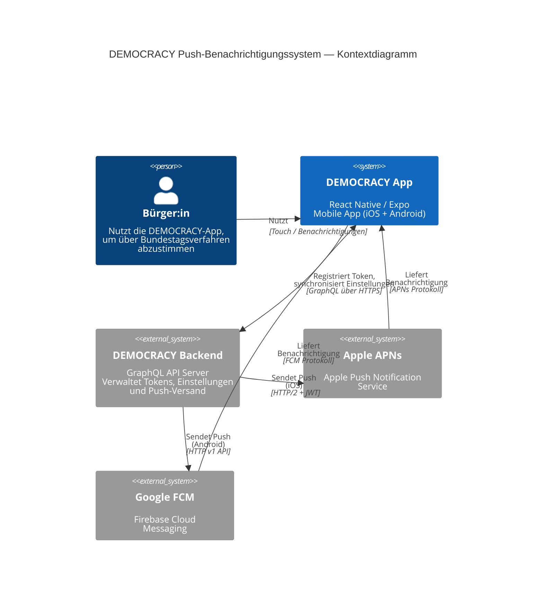

### Ablauf im Überblick

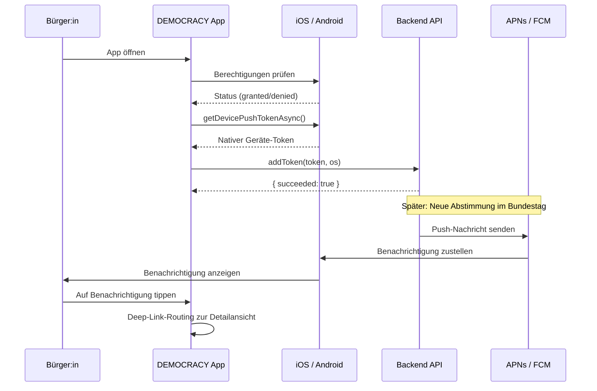

---

## 2. Architektur

### Initialisierungskette

Der gesamte Benachrichtigungs-Lifecycle wird durch eine kaskadierte Hook-Kette gesteuert. Jede Stufe fungiert als Gate für die nächste:

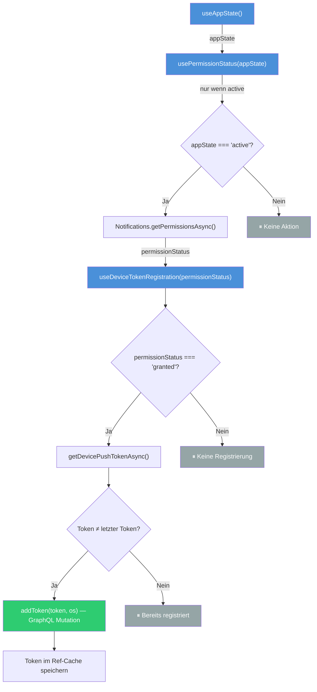

### Komponentendiagramm

Die folgende Grafik zeigt die Beziehungen zwischen den Kernmodulen des Benachrichtigungssystems:

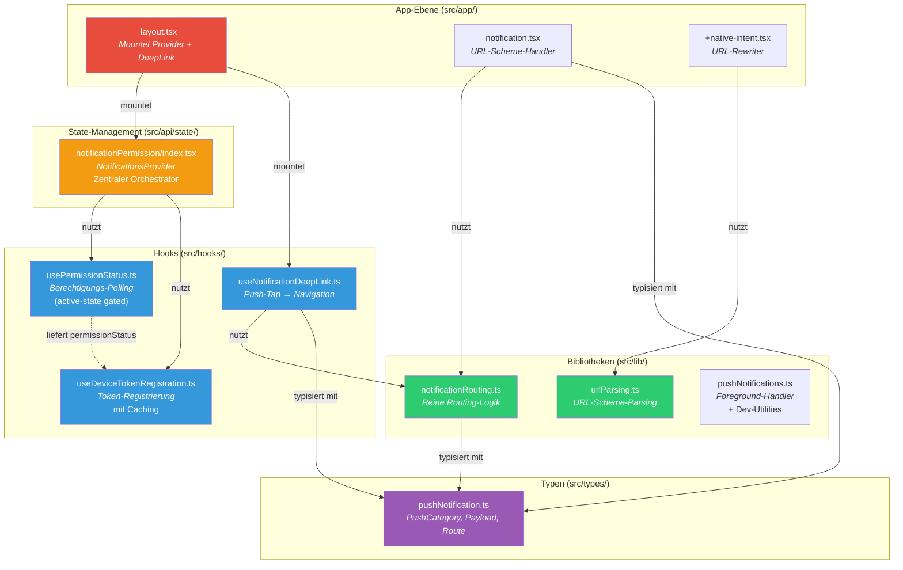

### Mounting-Hierarchie in `_layout.tsx`

```tsx
// src/app/_layout.tsx — vereinfacht
<VerificationProvider>
  <ApolloProvider client={client}>
    <NotificationsProvider>          {/* ← Orchestriert Berechtigungen + Token */}
      <NotificationDeepLinkHandler /> {/* ← useNotificationDeepLink() */}
      <Stack>
        {/* ... App-Screens */}
      </Stack>
    </NotificationsProvider>
  </ApolloProvider>
</VerificationProvider>
```

---

## 3. Berechtigungen

### Zwei Permission-Hooks

Das System unterscheidet zwischen zwei verschiedenen Berechtigungs-Hooks:

| Hook | Datei | Verhalten | Verwendung |
|------|-------|-----------|------------|
| `usePermissionStatus` | `src/hooks/usePermissionStatus.ts` | **Kontinuierlich**, reagiert auf AppState-Wechsel | `NotificationsProvider` (Systemebene) |
| `useNotificationPermission` | `src/screens/Introduction/useNotificationPermission.ts` | **Einmalig** beim Mount | Einzelne Screens (Onboarding) |

### `usePermissionStatus` — Kontinuierliches Berechtigungs-Polling

Dieser Hook prüft die Benachrichtigungsberechtigung **nur wenn die App aktiv** ist (`appState === 'active'`). Er vermeidet unnötige Abfragen während Background- oder Inactive-Zuständen.

```typescript
// src/hooks/usePermissionStatus.ts
export function usePermissionStatus(
  appState: AppStateStatus,
): PermissionStatus {
  const [status, setStatus] = useState<PermissionStatus>(null);

  useEffect(() => {
    if (appState !== "active") return;

    let cancelled = false;
    Notifications.getPermissionsAsync().then(({ status: s }) => {
      if (!cancelled) setStatus(s);
    });
    return () => { cancelled = true; };
  }, [appState]);

  return status;
}
```

**Rückgabewert:** `PermissionStatus | null`
- `null` — Noch keine Prüfung erfolgt (Initialzustand)
- `'granted'` — Berechtigung erteilt
- `'denied'` — Berechtigung verweigert
- `'undetermined'` — Nutzer:in wurde noch nicht gefragt

### `useNotificationPermission` — Einmalige Prüfung

```typescript
// src/screens/Introduction/useNotificationPermission.ts
export const useNotificationPermission = () => {
  const [authorized, setAuthorized] = useState(false);

  useEffect(() => {
    (async () => {
      const { status } = await Notifications.getPermissionsAsync();
      setAuthorized(status === "granted");
    })();
  }, []);

  return { authorized };
};
```

### Berechtigungs-Lifecycle

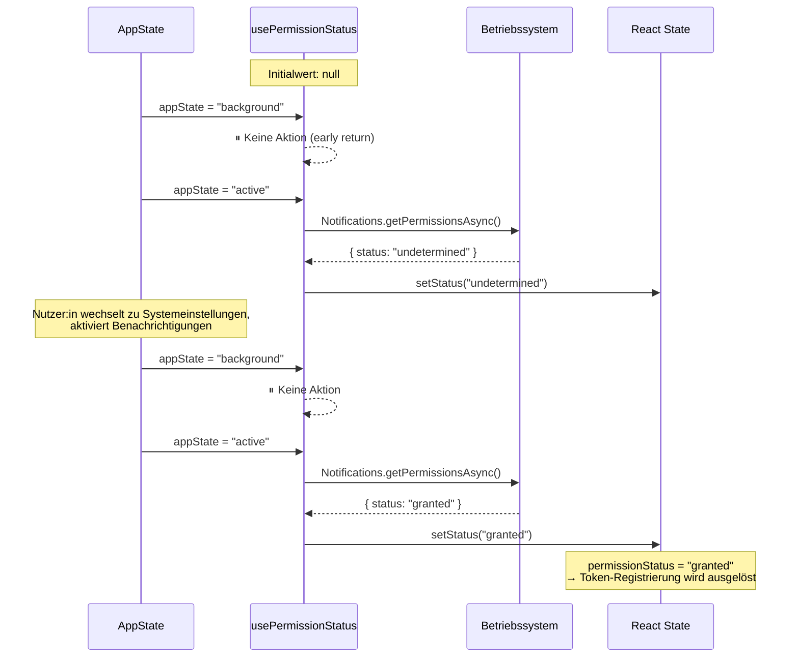

---

## 4. Token-Registrierung

### `useDeviceTokenRegistration`

Dieser Hook registriert den nativen Geräte-Token beim Backend, sobald die Berechtigung erteilt ist. Er enthält mehrere Schutzschichten:

1. **Permission-Gate**: Nur bei `permissionStatus === 'granted'`
2. **Token-Cache**: `useRef` verhindert redundante API-Aufrufe
3. **Auth-unabhängig**: Alle Nutzer:innen erhalten Pushes (kein Login erforderlich)
4. **Fehlerresistenz**: `.catch()` fängt alle Fehler ab — keine Crashes

```typescript
// src/hooks/useDeviceTokenRegistration.ts
export function useDeviceTokenRegistration(
  permissionStatus: Notifications.PermissionStatus | null,
): void {
  const [addToken] = useAddTokenMutation();
  const lastRegisteredTokenRef = useRef<string | null>(null);

  useEffect(() => {
    if (permissionStatus !== "granted") return;

    let cancelled = false;

    Notifications.getDevicePushTokenAsync()
      .then(({ data: token }) => {
        if (cancelled) return;
        if (token === lastRegisteredTokenRef.current) return; // ← Cache-Check

        addToken({ variables: { token, os: Platform.OS } })
          .then(() => { lastRegisteredTokenRef.current = token; })
          .catch((err) => { /* Fehler loggen, kein Crash */ });
      })
      .catch((err) => { /* Fehler loggen, kein Crash */ });

    return () => { cancelled = true; };
  }, [permissionStatus, addToken]);
}
```

### Registrierungsablauf

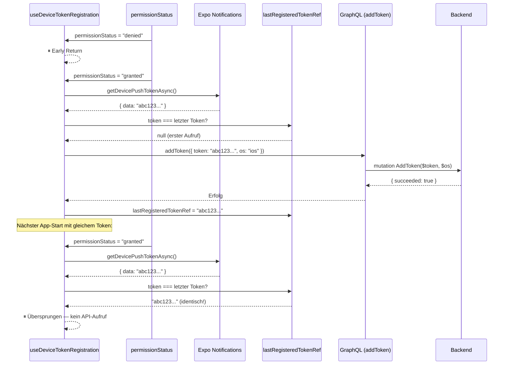

---

## 5. Benachrichtigungskategorien

Das Backend versendet vier verschiedene Benachrichtigungskategorien:

| Kategorie | Beschreibung | `type`-Feld | Routing-Strategie |
|-----------|-------------|-------------|-------------------|
| `top100` | Top-100 populäre Abstimmungen | `procedure` | List (Top100) + Detail |
| `conferenceWeek` | Sitzungswoche-Ankündigung | `procedureBulk` | List only (Sitzungswoche) |
| `conferenceWeekVote` | Wichtige Abstimmung der Woche | `procedure` | List (Sitzungswoche) + Detail |
| `outcome` | Abstimmungsergebnis | `procedure` | Detail only |

### Payload-Struktur

Jede Push-Nachricht enthält folgende Felder:

```typescript
// src/types/pushNotification.ts
export type PushCategory =
  | "top100"
  | "conferenceWeek"
  | "conferenceWeekVote"
  | "outcome";

export interface NotificationPayload {
  category?: PushCategory;
  type?: "procedure" | "procedureBulk";
  procedureId?: string;
  title?: string;
  message?: string;
  action?: string;
}
```

### APNs-Payload-Beispiel (vom Backend gesendet)

```json
{
  "aps": {
    "alert": {
      "title": "TOP 100 - #1: Jetzt Abstimmen!",
      "body": "Cannabis-Legalisierung"
    },
    "sound": "push.aiff",
    "mutable-content": 1
  },
  "type": "procedure",
  "action": "procedure",
  "category": "top100",
  "title": "TOP 100 - #1: Jetzt Abstimmen!",
  "message": "Cannabis-Legalisierung",
  "procedureId": "327971"
}
```

### Routing-Entscheidungslogik

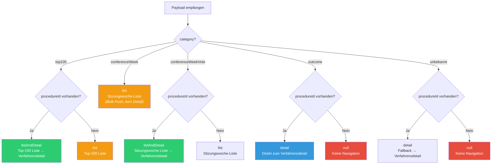

---

## 6. Deep-Link-Routing

Das System bietet **zwei Einstiegspunkte**, die auf dieselbe Routing-Logik konvergieren:

### Zwei Einstiegspunkte

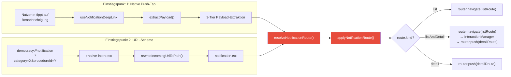

### Einstiegspunkt 1: Native Push-Tap

Der `useNotificationDeepLink`-Hook behandelt Taps auf Benachrichtigungen in drei Szenarien:

1. **Cold-Start**: App war beendet → `getLastNotificationResponseAsync()`
2. **Background**: App war im Hintergrund → `addNotificationResponseReceivedListener`
3. **Foreground**: App war aktiv → gleicher Listener

#### 3-Tier Payload-Extraktion

Da APNs-Payloads je nach Plattform und Zustellungsweg an verschiedenen Stellen liegen können, prüft `extractPayload()` drei Pfade:

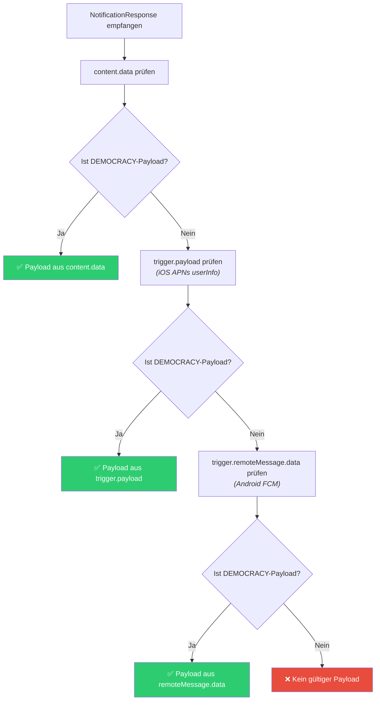

**Payload-Validierung** (`isNotificationPayload`): Ein gültiger DEMOCRACY-Payload muss immer das Feld `type` (`"procedure"` oder `"procedureBulk"`) enthalten. Dies verhindert Kollisionen mit nativen iOS-`aps.category`-Feldern.

#### Dedup-Mechanismus

Beim Cold-Start können sowohl `getLastNotificationResponseAsync()` als auch der Listener für denselben Tap feuern. Ein `handledIdRef` verhindert doppelte Navigation:

```typescript
const handledIdRef = useRef<string | null>(null);

const handleResponse = (response) => {
  const id = response.notification.request.identifier;
  if (handledIdRef.current === id) return; // ← Dedup
  handledIdRef.current = id;
  navigateFromNotification(router, response, legislaturePeriod);
};
```

### Einstiegspunkt 2: URL-Scheme

Das Custom-URL-Scheme `democracy://` ermöglicht Deep-Linking von außerhalb der App:

```
democracy://notification?category=top100&procedureId=327971
```

**Verarbeitungskette:**

1. **`+native-intent.tsx`** — Expo Routers URL-Rewriter:
   ```typescript
   export function redirectSystemPath({ path }) {
     return rewriteIncomingUrlToPath(path) ?? path;
   }
   ```

2. **`urlParsing.ts`** — Rewrites verschiedene URL-Formate:
   - `democracy://notification?...` → `/notification?...`
   - `democracy:///procedure/21-12345` → `/procedure/21-12345`
   - `https://democracy-app.de/gesetzentwurf/21-12345/slug` → `/procedure/21-12345`

3. **`notification.tsx`** — Route-Handler:
   ```typescript
   export default function NotificationDeepLinkScreen() {
     const params = useLocalSearchParams<{
       category?: PushCategory;
       procedureId?: string;
       e2e?: string;
     }>();

     useEffect(() => {
       const route = resolveNotificationRoute(
         { category: params.category, procedureId: params.procedureId },
         legislaturePeriod,
       );
       if (route) applyNotificationRoute(notificationRouter, route);
     }, [params]);

     return null; // Kein UI — reiner Routing-Screen
   }
   ```

### Drei Navigationsstrategien

```typescript
// src/types/pushNotification.ts
export type NotificationRoute =
  | { kind: "list"; listRoute: string }
  | { kind: "listAndDetail"; listRoute: string; detailRoute: string }
  | { kind: "detail"; detailRoute: string }
  | null;
```

| Strategie | Verhalten | Beispiel |
|-----------|-----------|---------|
| `list` | `router.navigate(listRoute)` | `conferenceWeek` → Sitzungswoche-Liste |
| `listAndDetail` | `router.navigate(listRoute)` → `InteractionManager` → `router.push(detailRoute)` | `top100` mit procedureId → Top-100 + Detail darüber |
| `detail` | `router.push(detailRoute)` | `outcome` → Direkt zum Verfahren |

Die `listAndDetail`-Strategie nutzt `InteractionManager.runAfterInteractions()`, um sicherzustellen, dass die List-Navigation abgeschlossen ist, bevor der Detail-Screen gepusht wird.

### Listen-Routen

```typescript
// src/lib/notificationRouting.ts
const LIST_ROUTES = {
  top100:             (lp) => `/(sidebar)/${lp}/Procedures/Top100`,
  conferenceWeek:     (lp) => `/(sidebar)/${lp}/Procedures/Sitzungswoche`,
  conferenceWeekVote: (lp) => `/(sidebar)/${lp}/Procedures/Sitzungswoche`,
};
```

Die Detail-Route ist immer: `/procedure/{procedureId}`

---

## 7. Benachrichtigungseinstellungen

### Context-Interface

```typescript
// src/api/state/notificationPermission/index.tsx
interface NotificationsInterface {
  outcomePushsDenied: boolean;
  notificationSettings: {
    enabled: boolean;
    conferenceWeekPushs: boolean;
    voteConferenceWeekPushs: boolean;
    voteTOP100Pushs: boolean;
    outcomePushs: boolean;
  };
  update: (options: UpdateNotificationSettingsMutationVariables) => void;
  setOutcomePushsDenied: (value: boolean) => void;
}
```

### State-Management-Architektur

Drei Systeme arbeiten zusammen, um den Benachrichtigungszustand zu verwalten:

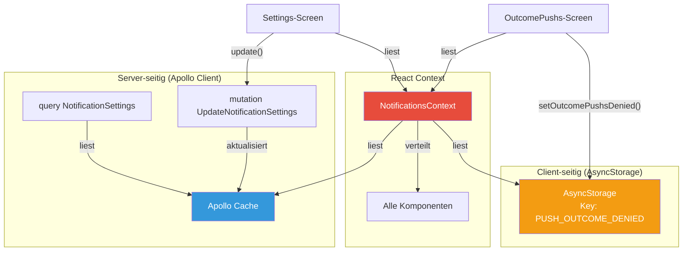

| System | Verantwortung | Schlüssel/Operationen |
|--------|--------------|----------------------|
| **Apollo Client** | Server-seitige Einstellungen | `NotificationSettings` Query + `UpdateNotificationSettings` Mutation |
| **AsyncStorage** | Client-seitige Opt-out-Entscheidung | `PUSH_OUTCOME_DENIED` |
| **React Context** | Komponentenübergreifende Verteilung | `NotificationsContext` |

### GraphQL-Operationen

#### Query: Einstellungen abrufen

```graphql
# src/api/state/notificationPermission/graphql/query/NotificationSettings.graphql
query NotificationSettings {
  notificationSettings {
    enabled
    conferenceWeekPushs
    voteConferenceWeekPushs
    voteTOP100Pushs
    outcomePushs
  }
}
```

#### Mutation: Einstellungen aktualisieren

```graphql
# src/api/state/notificationPermission/graphql/mutation/UpdateNotificationSettings.graphql
mutation UpdateNotificationSettings(
  $enabled: Boolean
  $conferenceWeekPushs: Boolean
  $voteConferenceWeekPushs: Boolean
  $voteTOP100Pushs: Boolean
  $outcomePushs: Boolean
) {
  updateNotificationSettings(
    enabled: $enabled
    conferenceWeekPushs: $conferenceWeekPushs
    voteConferenceWeekPushs: $voteConferenceWeekPushs
    voteTOP100Pushs: $voteTOP100Pushs
    outcomePushs: $outcomePushs
  ) {
    enabled
    conferenceWeekPushs
    voteConferenceWeekPushs
    voteTOP100Pushs
    outcomePushs
  }
}
```

#### Mutation: Geräte-Token registrieren

```graphql
# src/api/state/notificationPermission/graphql/mutation/AddToken.graphql
mutation AddToken($token: String!, $os: String!) {
  addToken(token: $token, os: $os) {
    succeeded
  }
}
```

#### Mutation: Pro-Verfahren-Benachrichtigung umschalten

```graphql
# src/screens/Procedure/graphql/muatation/toggleNotification.graphql
mutation ToggleNotification($procedureId: String!) {
  toggleNotification(procedureId: $procedureId) {
    notify
    procedureId
  }
}
```

### Cache-Update-Strategie

Die `update()`-Funktion führt ein optimistisches Cache-Update durch:

```typescript
updateSettings({
  variables: options,
  refetchQueries: [{ query: NotificationSettingsDocument }],
  update: (proxy, { data: updateData }) => {
    if (updateData?.updateNotificationSettings) {
      const cached = proxy.readQuery({ query: NotificationSettingsDocument });
      if (cached) {
        proxy.writeQuery({
          query: NotificationSettingsDocument,
          data: { ...cached, ...options },
        });
      }
    }
  },
});
```

---

## 8. UI-Komponenten

### Benachrichtigungs-Screens

Die App bietet mehrere UI-Touchpoints für Benachrichtigungen:

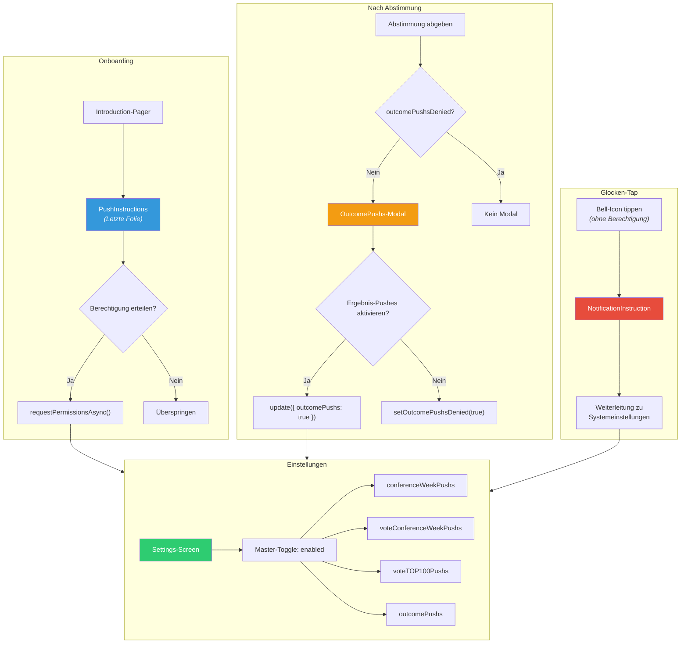

### 1. PushInstructions — Onboarding-Folie

**Pfad:** `src/screens/Introduction/PushInstructions/`

Die letzte Folie des Onboarding-Pagers. Zeigt Vorschau-Benachrichtigungen und fragt nach der Berechtigung.

**Dateien:**
- `index.tsx` — Haupt-Screen mit Berechtigungsanfrage
- `NotificationBox.tsx` — Vorschau-Benachrichtigungsboxen
- `data.ts` — Beispieldaten für Vorschau-Benachrichtigungen
- `useAppState.tsx` — AppState-Hook (für Erkennung der Rückkehr aus Einstellungen)

### 2. OutcomePushs — Post-Abstimmungs-Modal

**Pfad:** `src/screens/OutcomePushs/`

Modal-Dialog, der nach einer Abstimmung erscheint und fragt, ob Ergebnis-Benachrichtigungen aktiviert werden sollen. Wird nur angezeigt, wenn `outcomePushsDenied === false`.

### 3. NotificationInstruction — Glocken-Tap-Hinweis

**Pfad:** `src/screens/NotificationInstruction/`

Wird angezeigt, wenn Nutzer:innen auf das Glocken-Icon tippen, aber Benachrichtigungen nicht aktiviert sind. Enthält eine Weiterleitung zu den Systemeinstellungen.

### 4. Settings — Benachrichtigungseinstellungen

**Pfad:** `src/screens/Settings/`

Bietet einen Master-Toggle (`enabled`) und vier individuelle Kategorie-Toggles:

| Toggle | Schlüssel | Beschreibung |
|--------|----------|-------------|
| Hauptschalter | `enabled` | Aktiviert/deaktiviert alle Pushes |
| Sitzungswoche | `conferenceWeekPushs` | Ankündigung neuer Sitzungswochen |
| Abstimmung der Woche | `voteConferenceWeekPushs` | Wichtige Abstimmungen der Woche |
| Top 100 | `voteTOP100Pushs` | Populäre Abstimmungen |
| Ergebnisse | `outcomePushs` | Abstimmungsergebnisse |

### 5. Bell-Icons — Vier Varianten

SVG-basierte React-Native-Komponenten:

| Icon | Verwendung |
|------|-----------|
| `Bell` | Standard-Glocke (nicht abonniert) |
| `BellHeader` | Glocke in der Header-Leiste |
| `BellFilledHeader` | Ausgefüllte Glocke (abonniert) |
| `BellSlash` | Durchgestrichene Glocke (deaktiviert) |

### 6. NoConferenceWeekData

**Pfad:** `src/screens/Bundestag/List/NoConferenceWeekData.tsx`

Wird angezeigt, wenn keine Sitzungswoche-Daten vorliegen. Enthält einen „Benachrichtigen"-Button, der die Sitzungswoche-Benachrichtigungen aktiviert.

### 7. Pro-Verfahren-Benachrichtigungen

**Hook:** `src/screens/Procedure/hooks/useToggleNotification.ts`

Ermöglicht das Ein-/Ausschalten von Benachrichtigungen für einzelne Verfahren über die `ToggleNotification`-Mutation.

---

## 9. Dateistruktur

```
src/
├── hooks/
│   ├── usePermissionStatus.ts              # Berechtigungs-Polling (active-state gated)
│   ├── useDeviceTokenRegistration.ts       # Token-Registrierung mit Caching
│   ├── useNotificationDeepLink.ts          # Push-Tap → Screen-Navigation
│   └── __tests__/
│       ├── usePermissionStatus.test.ts     # 6 Tests
│       ├── useDeviceTokenRegistration.test.ts  # 9 Tests
│       └── useNotificationDeepLink.test.ts # Deep-Link-Tests
│
├── api/state/notificationPermission/
│   ├── index.tsx                           # NotificationsProvider (zentraler Orchestrator)
│   └── graphql/
│       ├── mutation/
│       │   ├── AddToken.graphql            # mutation AddToken($token, $os)
│       │   └── UpdateNotificationSettings.graphql
│       └── query/
│           └── NotificationSettings.graphql  # 5 boolesche Felder
│
├── lib/
│   ├── notificationRouting.ts              # Reine Routing-Logik (resolveNotificationRoute)
│   ├── urlParsing.ts                       # URL-Scheme-Parsing + Rewriting
│   ├── pushNotifications.ts                # Foreground-Handler + Dev-Utilities
│   └── __tests__/
│       ├── notificationRouting.test.ts     # Routing-Logik-Tests
│       └── urlParsing.test.ts              # URL-Parsing-Tests
│
├── types/
│   └── pushNotification.ts                 # PushCategory, NotificationPayload, NotificationRoute
│
├── app/
│   ├── _layout.tsx                         # Mountet NotificationsProvider + DeepLinkHandler
│   ├── notification.tsx                    # URL-Scheme-Route-Handler
│   ├── +native-intent.tsx                  # URL-Rewriting (Expo Router)
│   └── (dev)/
│       ├── pushNotificationTest.tsx        # E2E-Test-Screen (Scheduled Notification)
│       └── pushNotifications.tsx           # Dev-Push-Test-Screen
│
└── screens/
    ├── Introduction/
    │   ├── PushInstructions/               # Onboarding-Push-Folie
    │   │   ├── index.tsx
    │   │   ├── NotificationBox.tsx
    │   │   ├── data.ts
    │   │   └── useAppState.tsx
    │   └── useNotificationPermission.ts    # Einmalige Berechtigungsprüfung
    │
    ├── OutcomePushs/                       # Post-Abstimmungs-Benachrichtigungsdialog
    │   └── index.tsx
    │
    ├── NotificationInstruction/            # Glocken-Tap-Hinweis
    │   └── index.tsx
    │
    ├── Settings/                           # Benachrichtigungseinstellungen-Toggles
    │   ├── index.tsx
    │   └── components/ListItem.tsx
    │
    ├── Bundestag/List/
    │   └── NoConferenceWeekData.tsx         # "Benachrichtigen"-Button bei fehlenden Daten
    │
    └── Procedure/
        ├── hooks/
        │   └── useToggleNotification.ts    # Pro-Verfahren Glocken-Toggle
        └── graphql/muatation/
            └── toggleNotification.graphql
```

```
scripts/
├── push-test.mjs                           # CLI-Tool für echte APNs-Tests (HTTP/2 + JWT)
├── push-test.shared.js                     # Gemeinsame Payload-Builder + CLI-Parser
└── __tests__/
    └── push-test.shared.test.ts            # Tests für den Push-Test-Builder

.maestro/flows/
├── notification-top100.yaml                # E2E: URL-Scheme Top-100 Routing
├── notification-conference-week.yaml       # E2E: URL-Scheme Sitzungswoche Routing
├── notification-sitzungswoche-vote.yaml    # E2E: URL-Scheme Sitzungswoche-Vote Routing
├── notification-outcome.yaml               # E2E: URL-Scheme Outcome Routing
├── push-notification-top100.yaml           # E2E: Scheduled Push Top-100
├── push-notification-conference-week.yaml  # E2E: Scheduled Push Sitzungswoche
├── push-notification-conference-week-vote.yaml  # E2E: Scheduled Push Sitzungswoche-Vote
├── push-notification-outcome.yaml          # E2E: Scheduled Push Outcome
├── edge-case-conference-week-ignores-procedureid.yaml
├── edge-case-missing-procedureid.yaml
├── edge-case-top100-list-only.yaml
├── edge-case-unknown-category.yaml
├── deeplink.yaml                           # Web-URL Deep-Link
└── deeplink-cold-start.yaml                # Cold-Start Deep-Link
```

---

## 10. Konfiguration

### Expo-Plugin-Konfiguration

```typescript
// app.config.ts
plugins: [
  // ...
  [
    "expo-notifications",
    {
      enableBackgroundRemoteNotifications: true,  // ← Wichtig für Background-Delivery
    },
  ],
],
```

### iOS-Konfiguration

```typescript
// app.config.ts
ios: {
  bundleIdentifier: getBundleIdentifier(),
  // APNs-Environment je nach Build-Kontext:
  entitlements: {
    "aps-environment": process.env.CI ? "production" : "development",
  },
  associatedDomains: getAssociatedDomains().map((d) => `applinks:${d}`),
},
```

| Einstellung | Produktion | Entwicklung |
|------------|-----------|-------------|
| APNs-Environment | `production` | `development` |
| Bundle ID | `de.democracy-deutschland.clientapp` | `de.democracy-deutschland.clientapp.internal` |
| APNs Host | `api.push.apple.com` | `api.development.push.apple.com` |

### Android-Konfiguration

Die Datei `google-services.json` enthält die Firebase-Konfiguration:

- **Firebase-Projekt**: `democracy-90c66`
- **Package Name**: `de.democracydeutschland.app`
- **FCM Sender ID**: Automatisch aus `google-services.json`

### Foreground-Handler

```typescript
// src/lib/pushNotifications.ts
Notifications.setNotificationHandler({
  handleNotification: async () => ({
    shouldShowAlert: true,   // ← Benachrichtigung auch im Vordergrund anzeigen
    shouldPlaySound: true,
    shouldSetBadge: true,
  }),
});
```

### Android-Notification-Channel

```typescript
// src/lib/pushNotifications.ts (nur Android)
Notifications.setNotificationChannelAsync("default", {
  name: "default",
  importance: Notifications.AndroidImportance.MAX,
  vibrationPattern: [0, 250, 250, 250],
  lightColor: "#FF231F7C",
});
```

---

## 11. Testing

### Unit-Tests

Die Kernlogik ist durch umfangreiche Unit-Tests abgesichert:

| Testdatei | Modul | Anzahl Tests | Beschreibung |
|-----------|-------|-------------|-------------|
| `src/hooks/__tests__/usePermissionStatus.test.ts` | `usePermissionStatus` | 6 | AppState-Gating, Initialwert, Statusaktualisierung |
| `src/hooks/__tests__/useDeviceTokenRegistration.test.ts` | `useDeviceTokenRegistration` | 9 | Permission-Gate, Token-Caching, Fehlerbehandlung |
| `src/hooks/__tests__/useNotificationDeepLink.test.ts` | `useNotificationDeepLink` | — | Payload-Extraktion, Dedup, Cold-Start |
| `src/lib/__tests__/notificationRouting.test.ts` | `notificationRouting` | — | Alle Kategorien, Fallbacks, E2E-Marker |
| `src/lib/__tests__/urlParsing.test.ts` | `urlParsing` | — | URL-Rewriting, Web-URLs, Custom-Scheme |
| `scripts/__tests__/push-test.shared.test.ts` | `push-test.shared` | — | Payload-Builder, CLI-Arg-Parsing |

**Ausführung:**

```bash
pnpm test
```

### E2E-Tests (Maestro)

15 Maestro-Flows testen das Benachrichtigungssystem end-to-end auf dem Simulator:

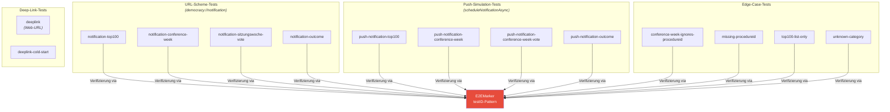

**Testmuster:** Jeder Flow nutzt das `democracy://notification`-URL-Scheme oder `scheduleNotificationAsync` (2-Sekunden-Fallback) und verifiziert das korrekte Routing über `E2EMarker`-testIDs.

**Ausführung:**

```bash
# Alle E2E-Tests
maestro test .maestro/flows/

# Einzelner Flow
maestro test .maestro/flows/notification-top100.yaml
```

### CLI-Tool für echte Geräte-Tests

Das Script `scripts/push-test.mjs` sendet echte Push-Benachrichtigungen über APNs HTTP/2 mit JWT-Authentifizierung:

```bash
# Einzelne Kategorie
pnpm push:notification:device <device-token> top100 327971

# Alle 4 Kategorien (3s Abstand)
pnpm push:notification:device <device-token> --all

# Mit eigenem Verfahrenstitel
pnpm push:notification:device <device-token> outcome 327971 "Cannabis-Legalisierung"
```

**Voraussetzungen:**
- APNs Authentication Key (`.p8`-Datei) — wird automatisch gesucht
- Physisches iOS-Gerät mit gültigem Device-Token
- App im Development-Build installiert

**Umgebungsvariablen:**

| Variable | Standard | Beschreibung |
|----------|---------|-------------|
| `APNS_KEY_PATH` | Auto-Erkennung | Pfad zur `.p8`-Datei |
| `APNS_KEY_ID` | Aus Dateiname | Key-ID aus dem Apple Developer Portal |
| `APNS_TEAM_ID` | `A4B84UJD7M` | Apple Developer Team ID |
| `APNS_BUNDLE_ID` | `...clientapp.internal` | App Bundle-ID |
| `APNS_ENV` | `development` | `development` oder `production` |
