# Push-Notification Routing & Deep Linking

> **Deep-Dive Dokumentation** des Subsystems für Push-Notification-Routing und Deep Linking in der DEMOCRACY App.

---

## Inhaltsverzeichnis

- [1. Übersicht](#1-übersicht)
- [2. Typsystem](#2-typsystem)
- [3. Entry Point 1: Nativer Push-Tap (`useNotificationDeepLink`)](#3-entry-point-1-nativer-push-tap-usenotificationdeeplink)
  - [3.1 Cold-Start vs. Foreground-Handling](#31-cold-start-vs-foreground-handling)
  - [3.2 Payload-Extraktion (`extractPayload`)](#32-payload-extraktion-extractpayload)
  - [3.3 Navigation-Ausführung (`navigateFromNotification`)](#33-navigation-ausführung-navigatefromnotification)
- [4. Entry Point 2: URL-Schema (`democracy://notification`)](#4-entry-point-2-url-schema-democracynotification)
  - [4.1 URL-Parsing im Detail](#41-url-parsing-im-detail)
- [5. Routing-Logik (`resolveNotificationRoute`)](#5-routing-logik-resolvenotificationroute)
- [6. Navigation-Strategien (`applyNotificationRoute`)](#6-navigation-strategien-applynotificationroute)
- [7. E2E-Testing](#7-e2e-testing)
- [8. Web-URL Deep Links](#8-web-url-deep-links)
- [9. Dateiübersicht](#9-dateiübersicht)

---

## 1. Übersicht

Das Routing-System besitzt **zwei parallele Einstiegspunkte**, die auf einer gemeinsamen, reinen Routing-Logik konvergieren. Dadurch wird eine konsistente Navigation gewährleistet — unabhängig davon, ob eine Notification nativ angetippt oder über ein URL-Schema geöffnet wird.

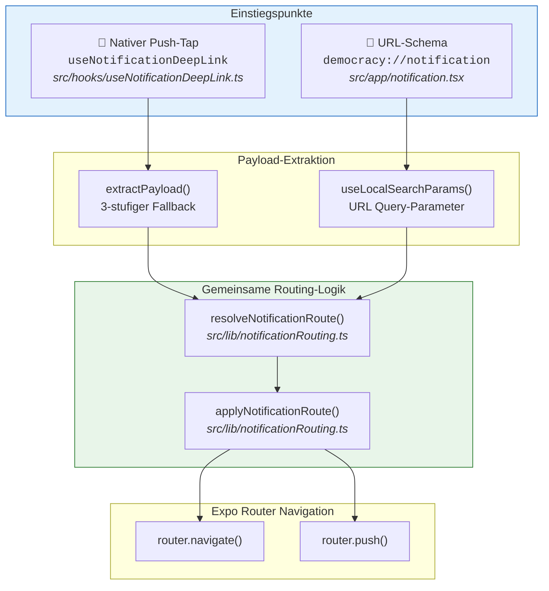

**Architektur-Prinzipien:**

1. **Reine Funktionen:** `resolveNotificationRoute()` und `applyNotificationRoute()` sind plattformunabhängig und zustandslos — ideal für Unit-Tests.
2. **Deduplizierung:** `handledIdRef` verhindert doppelte Navigation beim Cold-Start.
3. **Scheduling:** `InteractionManager.runAfterInteractions` stellt sicher, dass zweistufige Navigationen (Liste → Detail) erst nach Abschluss der Animations-Transition erfolgen.

---

## 2. Typsystem

> 📄 **Datei:** `src/types/pushNotification.ts` (34 Zeilen)

Alle Typen des Notification-Routing-Subsystems sind in einer einzigen Datei definiert:

```typescript
// src/types/pushNotification.ts

export type PushCategory =
  | "top100"
  | "conferenceWeek"
  | "conferenceWeekVote"
  | "outcome";

export interface NotificationPayload {
  category?: PushCategory;
  type?: "procedure" | "procedureBulk";
  procedureId?: string;
  title?: string;
  message?: string;
  action?: string;
}

export type NotificationRoute =
  | { kind: "list"; listRoute: string }
  | { kind: "listAndDetail"; listRoute: string; detailRoute: string }
  | { kind: "detail"; detailRoute: string }
  | null;

export interface NotificationRouter {
  navigate: (route: string) => void;
  push: (route: string) => void;
  schedule?: (task: () => void) => void;
}
```

### Klassendiagramm

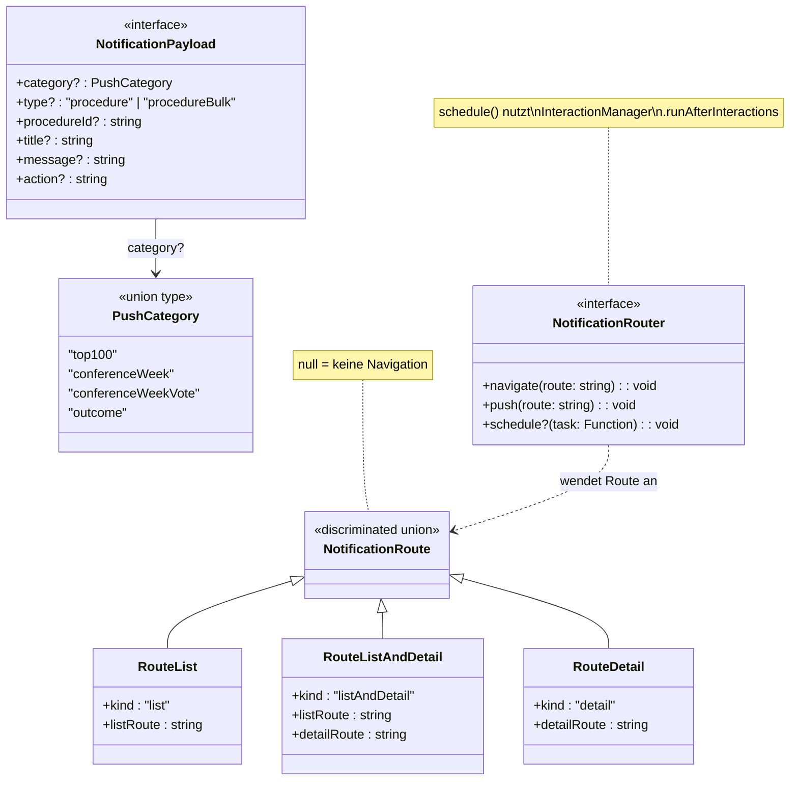

### Typ-Erklärungen

| Typ | Zweck |
|---|---|
| `PushCategory` | Diskriminator — bestimmt, zu welchem Listenscreen navigiert wird |
| `NotificationPayload` | Daten aus der Push-Notification (Server oder lokal) |
| `NotificationRoute` | Aufgelöstes Navigations-Ziel (discriminated union mit `kind`) |
| `NotificationRouter` | Abstraktionsschicht über Expo Router — ermöglicht testbare Routing-Logik |

> **Design-Entscheidung:** `NotificationRouter` abstrahiert den Expo Router, damit `applyNotificationRoute()` als reine Funktion ohne React-Kontext getestet werden kann. Das optionale `schedule`-Feld erlaubt die zeitliche Steuerung von zweistufigen Navigationen.

---

## 3. Entry Point 1: Nativer Push-Tap (`useNotificationDeepLink`)

> 📄 **Datei:** `src/hooks/useNotificationDeepLink.ts` (202 Zeilen)
>
> **Exports:** `isNotificationPayload`, `extractPayload`, `useNotificationDeepLink`

Dieser Hook wird in `src/app/_layout.tsx` als `<NotificationDeepLinkHandler />` Komponente eingebunden und verarbeitet alle nativen Push-Notification-Taps.

### 3.1 Cold-Start vs. Foreground-Handling

Es gibt zwei Szenarien, in denen eine Push-Notification die App erreicht:

| Szenario | API | Timing |
|---|---|---|
| **Cold-Start** | `Notifications.getLastNotificationResponseAsync()` | Einmalig beim Mount |
| **Foreground / Background** | `Notifications.addNotificationResponseReceivedListener()` | Event-basiert |

**Deduplizierung:** Beide Pfade können beim Cold-Start für denselben Tap feuern. `handledIdRef` (ein `useRef<string | null>`) speichert den `notification.request.identifier` der zuletzt verarbeiteten Notification und verhindert so doppelte Navigation.

```typescript
// src/hooks/useNotificationDeepLink.ts:167-201
export function useNotificationDeepLink(): void {
  const router = useRouter();
  const { legislaturePeriod } = useLegislaturePeriodStore();
  const handledIdRef = useRef<string | null>(null);

  useEffect(() => {
    let isActive = true;
    const lp = legislaturePeriod ?? "";

    const handleResponse = (response: Notifications.NotificationResponse) => {
      if (!isActive) return;
      const id = response.notification.request.identifier;
      if (handledIdRef.current === id) return;  // Dedup-Check
      handledIdRef.current = id;
      navigateFromNotification(router, response, lp);
    };

    // Cold-Start
    Notifications.getLastNotificationResponseAsync().then((response) => {
      if (response) handleResponse(response);
    });

    // Foreground / Background
    const subscription =
      Notifications.addNotificationResponseReceivedListener(handleResponse);

    return () => {
      isActive = false;
      Notifications.removeNotificationSubscription(subscription);
    };
  }, [router, legislaturePeriod]);
}
```

#### Sequenzdiagramm: Cold-Start vs. Foreground

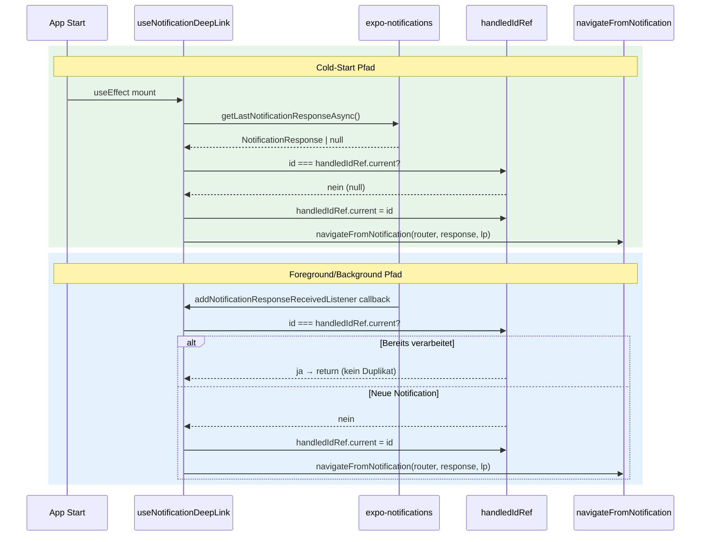

### 3.2 Payload-Extraktion (`extractPayload`)

Die Funktion `extractPayload` implementiert einen **3-stufigen Fallback** für plattformübergreifende Kompatibilität. Jeder Level wird mit dem Type Guard `isNotificationPayload()` validiert.

```typescript
// src/hooks/useNotificationDeepLink.ts:12
const VALID_TYPES = ["procedure", "procedureBulk"] as const;
```

#### Type Guard: `isNotificationPayload`

```typescript
// src/hooks/useNotificationDeepLink.ts:19-33
export function isNotificationPayload(
  obj: Record<string, unknown>,
): boolean {
  if (obj == null || typeof obj !== "object") return false;

  const hasType =
    typeof obj.type === "string" &&
    VALID_TYPES.includes(obj.type as (typeof VALID_TYPES)[number]);
  const hasCategory = typeof obj.category === "string";
  const hasProcedureId = typeof obj.procedureId === "string";

  return hasType && (hasCategory || hasProcedureId);
}
```

**Validierungsregeln:**
- `type`-Feld **muss** vorhanden sein und einen Wert aus `VALID_TYPES` enthalten
- **Plus** entweder `category` **oder** `procedureId`
- Das Erfordernis von `type` verhindert Kollisionen mit dem iOS-eigenen `aps.category`-Feld

#### 3-Stufen-Fallback-Kaskade

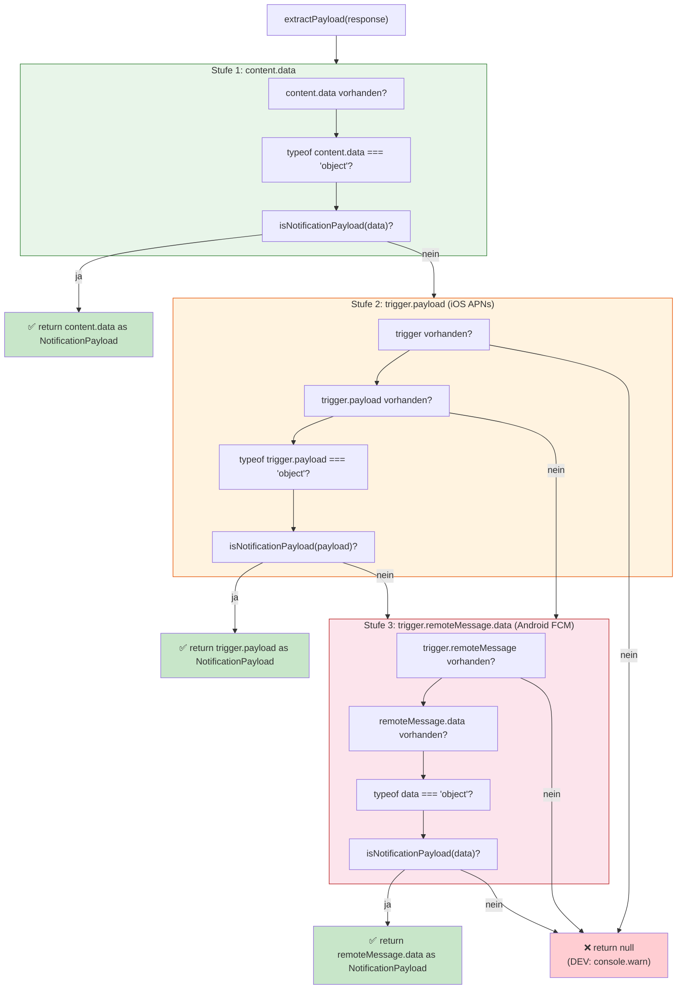

| Stufe | Pfad | Plattform / Quelle |
|---|---|---|
| 1 | `response.notification.request.content.data` | Expo Push Service, lokale Notifications |
| 2 | `response.notification.request.trigger.payload` | iOS — rohe APNs `userInfo` |
| 3 | `response.notification.request.trigger.remoteMessage.data` | Android — FCM `RemoteMessage` |

### 3.3 Navigation-Ausführung (`navigateFromNotification`)

Die private Funktion `navigateFromNotification` orchestriert den gesamten Ablauf:

```typescript
// src/hooks/useNotificationDeepLink.ts:124-153
function navigateFromNotification(
  router: ReturnType<typeof useRouter>,
  response: Notifications.NotificationResponse,
  legislaturePeriod: string,
): void {
  const data = extractPayload(response);
  if (!data) { return; }

  const route = resolveNotificationRoute(data, legislaturePeriod);
  if (!route) return;

  const notificationRouter: NotificationRouter = {
    navigate: (route) => {
      router.navigate(route as Parameters<typeof router.navigate>[0]);
    },
    push: (route) => {
      router.push(route as Parameters<typeof router.push>[0]);
    },
    schedule: (task) => {
      InteractionManager.runAfterInteractions(task);
    },
  };

  applyNotificationRoute(notificationRouter, route);
}
```

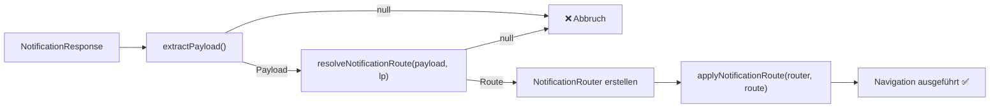

---

## 4. Entry Point 2: URL-Schema (`democracy://notification`)

> 📄 **Dateien:**
> - `src/app/+native-intent.tsx` (10 Zeilen) — URL-Rewriter
> - `src/app/notification.tsx` (57 Zeilen) — Route-Handler-Screen
> - `src/lib/urlParsing.ts` (178 Zeilen) — URL-Parsing-Utilities

Dieser Einstiegspunkt wird ausgelöst, wenn das System eine URL mit dem Schema `democracy://` öffnet — z. B. durch einen Universal Link oder einen E2E-Test.

### Ablauf

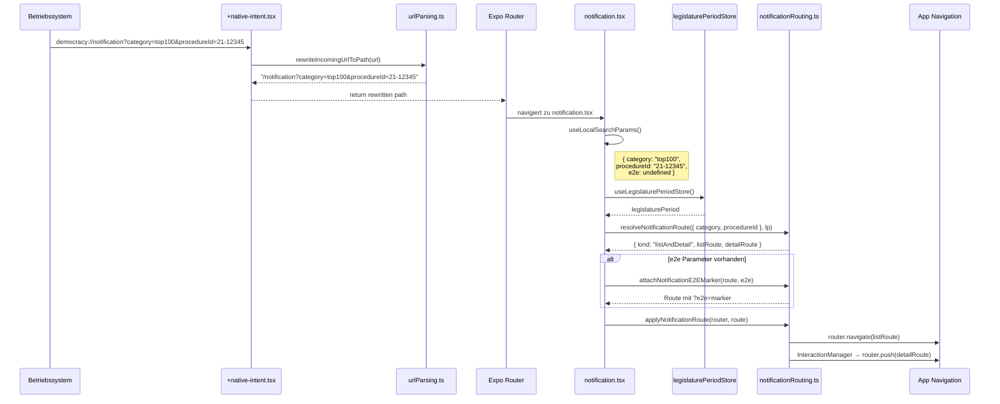

#### URL-Rewriter (`+native-intent.tsx`)

```typescript
// src/app/+native-intent.tsx (vollständig)
import { rewriteIncomingUrlToPath } from "../lib/urlParsing";

export function redirectSystemPath({
  path,
}: {
  path: string;
  initial: boolean;
}): string {
  return rewriteIncomingUrlToPath(path) ?? path;
}
```

> **Hinweis:** `redirectSystemPath` ist eine Expo-Router-Konvention. Die Datei `+native-intent.tsx` wird automatisch von Expo Router erkannt und bei jedem eingehenden Deep Link aufgerufen.

#### Route-Handler (`notification.tsx`)

```typescript
// src/app/notification.tsx (vollständig)
export default function NotificationDeepLinkScreen() {
  const params = useLocalSearchParams<{
    category?: NotificationPayload["category"];
    procedureId?: string;
    e2e?: string;
  }>();
  const router = useRouter();
  const { legislaturePeriod } = useLegislaturePeriodStore();

  useEffect(() => {
    const lp = legislaturePeriod ?? "";
    const resolvedRoute = resolveNotificationRoute(
      { category: params.category, procedureId: params.procedureId },
      lp,
    );

    if (!resolvedRoute) { return; }

    const route = attachNotificationE2EMarker(resolvedRoute, params.e2e);

    const notificationRouter: NotificationRouter = {
      navigate: (targetRoute) => {
        router.navigate(targetRoute as Parameters<typeof router.navigate>[0]);
      },
      push: (targetRoute) => {
        router.push(targetRoute as Parameters<typeof router.push>[0]);
      },
      schedule: (task) => {
        InteractionManager.runAfterInteractions(task);
      },
    };

    applyNotificationRoute(notificationRouter, route);
  }, [params.category, params.procedureId, params.e2e, legislaturePeriod, router]);

  return null;  // Renderless Weiterleitung
}
```

### 4.1 URL-Parsing im Detail

> 📄 **Datei:** `src/lib/urlParsing.ts` (178 Zeilen)

#### Konfiguration

```typescript
// src/lib/urlParsing.ts:16-28
const PROCEDURE_TYPE_PATTERN =
  /^(gesetzentwurf|antrag|entschließungsantrag|selbständiger\s*antrag)$/i;

const PROCEDURE_ID_PATTERN = /^\d{1,2}-\d+$/;

const KNOWN_DOMAINS = [
  "democracy-app.de",
  "internal.democracy-app.de",
  "alpha.democracy-app.de",
  "beta.democracy-app.de",
];

const CUSTOM_SCHEME = "democracy:";
```

| Konstante | Beschreibung | Beispiele |
|---|---|---|
| `KNOWN_DOMAINS` | Akzeptierte Web-Domains | `democracy-app.de`, `alpha.democracy-app.de` |
| `CUSTOM_SCHEME` | Eigenes URL-Schema | `democracy:` |
| `PROCEDURE_TYPE_PATTERN` | Gültige Verfahrenstypen in Web-URLs | `gesetzentwurf`, `antrag`, `entschließungsantrag`, `selbständiger antrag` |
| `PROCEDURE_ID_PATTERN` | Format: `{LP}-{Nummer}` | `21-12345`, `20-9999` |

#### `rewriteIncomingUrlToPath` — Routing-Entscheidungen

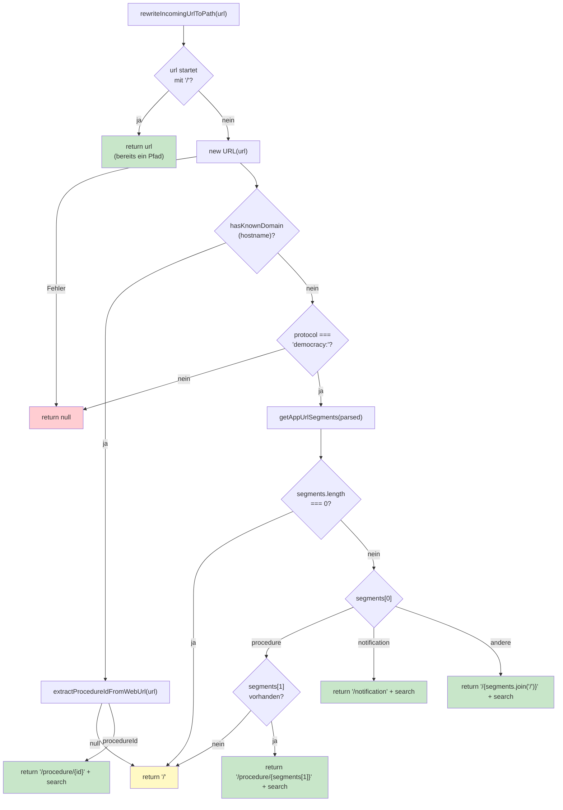

#### Beispiel-Transformationen

| Eingehende URL | Ergebnis |
|---|---|
| `democracy:///procedure/21-12345` | `/procedure/21-12345` |
| `democracy://notification?category=top100&procedureId=21-12345` | `/notification?category=top100&procedureId=21-12345` |
| `https://democracy-app.de/gesetzentwurf/21-12345/slug` | `/procedure/21-12345` |
| `https://alpha.democracy-app.de/antrag/20-9999/titel` | `/procedure/20-9999` |
| `https://unknown-domain.de/something` | `null` (Fallback auf Original-Pfad) |
| `/already/a/path` | `/already/a/path` (unverändert) |

---

## 5. Routing-Logik (`resolveNotificationRoute`)

> 📄 **Datei:** `src/lib/notificationRouting.ts` (128 Zeilen)
>
> **Export:** `resolveNotificationRoute(data: NotificationPayload, legislaturePeriod: string): NotificationRoute`

### LIST_ROUTES Mapping

```typescript
// src/lib/notificationRouting.ts:8-15
const LIST_ROUTES: Record<
  Exclude<PushCategory, "outcome">,
  (legislaturePeriod: string) => string
> = {
  top100: (lp) => `/(sidebar)/${lp}/Procedures/Top100`,
  conferenceWeek: (lp) => `/(sidebar)/${lp}/Procedures/Sitzungswoche`,
  conferenceWeekVote: (lp) => `/(sidebar)/${lp}/Procedures/Sitzungswoche`,
};
```

> **Beachte:** `conferenceWeek` und `conferenceWeekVote` teilen sich denselben Listen-Screen (`Sitzungswoche`), unterscheiden sich aber im Routing-Verhalten (nur Liste vs. Liste + Detail).

### Detail-Route-Pattern

```
/procedure/{procedureId}
```

### Kategorie → Route-Art Mapping

| Kategorie | Route-Art | Verhalten | Voraussetzung |
|---|---|---|---|
| `top100` | `listAndDetail` | Navigiert zu Top-100-Liste, pusht dann Detail | `procedureId` vorhanden |
| `top100` | `list` | Navigiert nur zu Top-100-Liste | kein `procedureId` |
| `conferenceWeek` | `list` | Navigiert nur zu Sitzungswoche-Liste | immer (Bulk-Push) |
| `conferenceWeekVote` | `listAndDetail` | Navigiert zu Sitzungswoche, pusht dann Detail | `procedureId` vorhanden |
| `conferenceWeekVote` | `list` | Navigiert nur zu Sitzungswoche-Liste | kein `procedureId` |
| `outcome` | `detail` | Pusht direkt zum Verfahrens-Detail | `procedureId` vorhanden |
| `outcome` | `null` | Keine Navigation | kein `procedureId` |
| unbekannt | `detail` (Fallback) | Pusht direkt zum Verfahrens-Detail | `procedureId` vorhanden |
| unbekannt | `null` | Keine Navigation | kein `procedureId` |

### Entscheidungsbaum

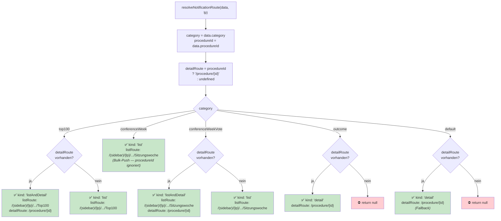

---

## 6. Navigation-Strategien (`applyNotificationRoute`)

> 📄 **Datei:** `src/lib/notificationRouting.ts:105-127`
>
> **Export:** `applyNotificationRoute(router: NotificationRouter, route: NonNullable<NotificationRoute>): void`

Es gibt drei Navigations-Strategien, die je nach `route.kind` angewendet werden:

```typescript
// src/lib/notificationRouting.ts:105-127
export function applyNotificationRoute(
  router: NotificationRouter,
  route: NonNullable<NotificationRoute>,
): void {
  switch (route.kind) {
    case "list":
      router.navigate(route.listRoute);
      break;
    case "listAndDetail":
      router.navigate(route.listRoute);
      if (router.schedule) {
        router.schedule(() => {
          router.push(route.detailRoute);
        });
      } else {
        router.push(route.detailRoute);
      }
      break;
    case "detail":
      router.push(route.detailRoute);
      break;
  }
}
```

### Strategie-Vergleich

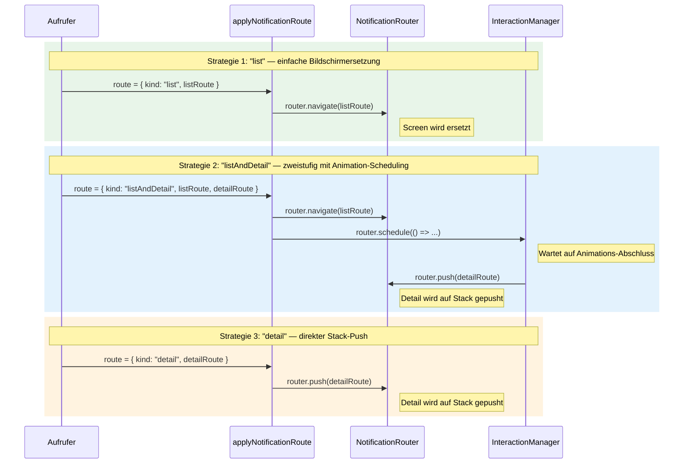

| Strategie | Methode | Verhalten | Zurück-Navigation |
|---|---|---|---|
| `list` | `router.navigate()` | Ersetzt den aktuellen Screen | Zurück zum vorherigen Screen |
| `listAndDetail` | `router.navigate()` → `router.push()` | Navigiert zur Liste, dann Push des Details nach Animations-Abschluss | Zurück → Liste → vorheriger Screen |
| `detail` | `router.push()` | Pusht Detail auf den aktuellen Stack | Zurück zum vorherigen Screen |

> **Warum `InteractionManager`?** Ohne Scheduling kann der zweite Navigations-Aufruf (`router.push`) die noch laufende Transition des ersten (`router.navigate`) überschreiben. `InteractionManager.runAfterInteractions` stellt sicher, dass der Push erst erfolgt, wenn die erste Animation abgeschlossen ist.

---

## 7. E2E-Testing

> 📄 **Datei:** `src/app/(dev)/pushNotificationTest.tsx` (163 Zeilen)

### Überblick

Die App stellt einen Dev-only Screen bereit, der Push-Notification-Routing end-to-end testet, indem er:

1. Eine **lokale Notification** mit produktionsidentischer Datenstruktur plant
2. Auf die Zustellung über die expo-notifications-Pipeline wartet
3. Die Daten aus der empfangenen Notification extrahiert (beweist Datenintegrität)
4. Mit der **identischen Produktions-Routing-Logik** navigiert

### E2E-Marker-System

Die Funktion `attachNotificationE2EMarker` hängt einen `?e2e=<marker>` Query-Parameter an die aufgelöste Route an:

```typescript
// src/lib/notificationRouting.ts:82-103
export function attachNotificationE2EMarker(
  route: NonNullable<NotificationRoute>,
  marker?: string,
): NonNullable<NotificationRoute> {
  switch (route.kind) {
    case "list":
      return { ...route, listRoute: withE2EMarker(route.listRoute, marker) };
    case "listAndDetail":
      return { ...route, detailRoute: withE2EMarker(route.detailRoute, marker) };
    case "detail":
      return { ...route, detailRoute: withE2EMarker(route.detailRoute, marker) };
  }
}
```

> **Beachte:** Bei `list` wird der Marker an die `listRoute` angehängt, bei `listAndDetail` und `detail` an die `detailRoute`. Damit kann das E2E-Framework (Maestro) auf dem Ziel-Screen den erwarteten testID-Marker prüfen.

### Suffix-Konventionen

| Suffix | Bedeutung |
|---|---|
| `-via-notification` | Daten kamen über die expo-notifications-Pipeline (Normalfall) |
| `-via-fallback` | Fallback-Timer hat gefeuert (z. B. Berechtigungen nicht erteilt) |

**Beispiel:** `e2e=push-top100` wird zu `push-top100-via-notification` oder `push-top100-via-fallback`.

### Fallback-Mechanismus

```typescript
// src/app/(dev)/pushNotificationTest.tsx:17
const FALLBACK_DELAY_MS = 2000;
```

Falls die Notification-Pipeline nicht verfügbar ist (z. B. fehlende Berechtigungen auf dem Simulator), leitet ein `setTimeout` nach `FALLBACK_DELAY_MS` (Standard: 2000ms) direkt über die URL-Parameter weiter. Der Delay ist über den `fallbackMs` Query-Parameter konfigurierbar.

### E2E-Testfluss

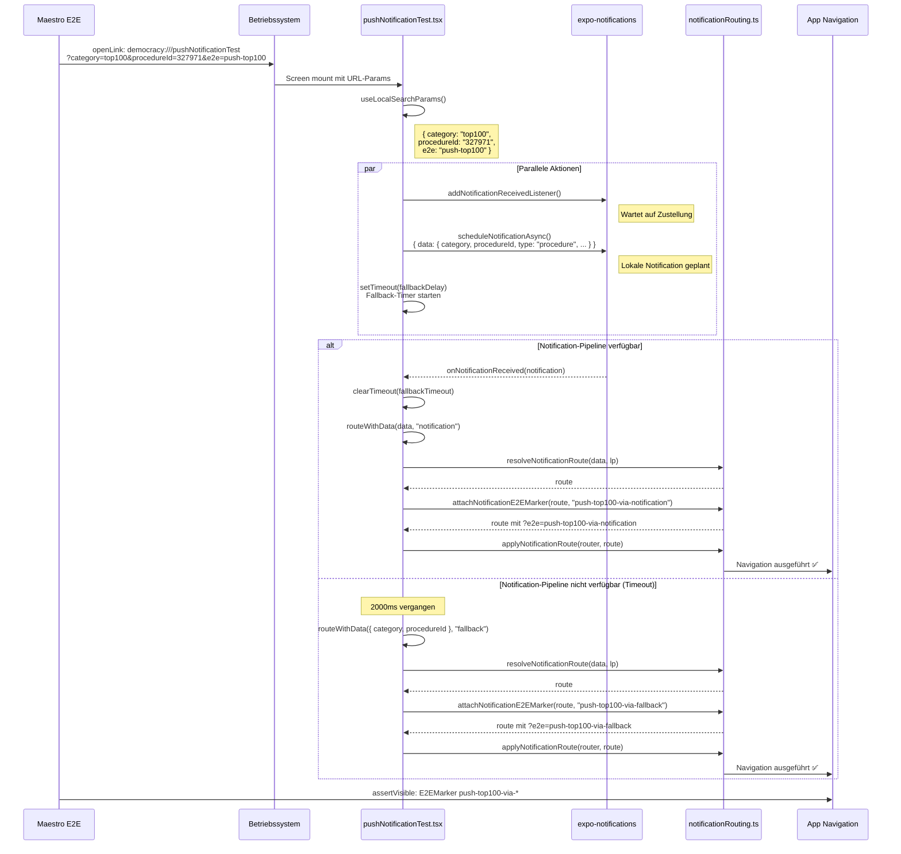

### Maestro-Nutzung

```yaml
# .maestro/flows/push-notification-top100.yaml
- openLink: democracy:///pushNotificationTest?category=top100&procedureId=327971&e2e=push-top100
```

> **Hinweis:** E2E nutzt `addNotificationReceivedListener` (Zustellung) statt `addNotificationResponseReceivedListener` (Tap), da Maestro nicht mit dem iOS Notification Tray interagieren kann. Produktionscode nutzt den Response-Listener in `useNotificationDeepLink.ts`.

---

## 8. Web-URL Deep Links

Web-URLs von `democracy-app.de` werden ebenfalls als Deep Links unterstützt und über den `+native-intent.tsx` Rewriter verarbeitet.

### Ablauf

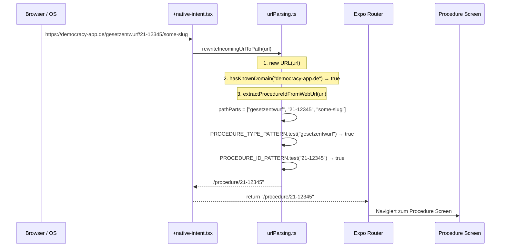

### URL-Validierungs-Pipeline

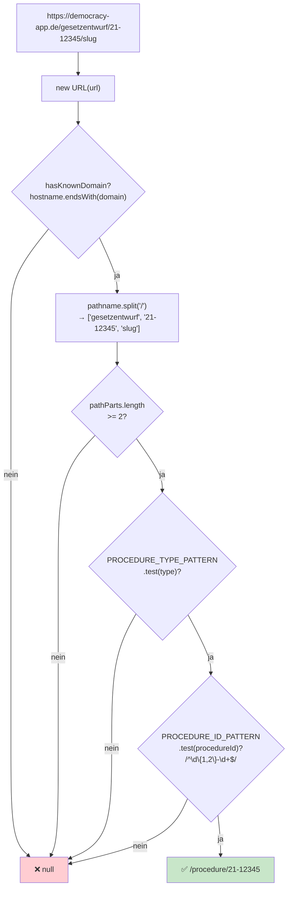

### Unterstützte Verfahrenstypen

| Typ | Regex-Match | Beispiel-URL |
|---|---|---|
| `gesetzentwurf` | ✅ | `https://democracy-app.de/gesetzentwurf/21-12345/titel` |
| `antrag` | ✅ | `https://democracy-app.de/antrag/20-9999/titel` |
| `entschließungsantrag` | ✅ | `https://democracy-app.de/entschließungsantrag/21-5678/titel` |
| `selbständiger antrag` | ✅ | `https://democracy-app.de/selbständiger%20antrag/21-1111/titel` |

---

## 9. Dateiübersicht

### Kern-Dateien

| Datei | Zeilen | Verantwortlichkeit |
|---|---|---|
| `src/types/pushNotification.ts` | 34 | Alle Typen des Subsystems |
| `src/hooks/useNotificationDeepLink.ts` | 202 | Nativer Push-Tap-Handler (Cold-Start + Foreground) |
| `src/lib/notificationRouting.ts` | 128 | Reine Routing-Logik, E2E-Marker, Route-Anwendung |
| `src/lib/urlParsing.ts` | 178 | URL-Parsing, Web-URL-Erkennung, Schema-Rewriting |
| `src/app/+native-intent.tsx` | 10 | Expo Router URL-Rewriter |
| `src/app/notification.tsx` | 57 | URL-Schema Route-Handler-Screen |
| `src/app/(dev)/pushNotificationTest.tsx` | 163 | E2E-Test-Screen für Push-Notification-Routing |

### Konsumenten

| Datei | Verwendung |
|---|---|
| `src/app/_layout.tsx` | Mountet `useNotificationDeepLink` als `<NotificationDeepLinkHandler />` |

### Test-Dateien

| Datei | Zeilen | Abdeckung |
|---|---|---|
| `src/lib/__tests__/notificationRouting.test.ts` | 252 | `resolveNotificationRoute` (12), `applyNotificationRoute` (4), `attachNotificationE2EMarker` (3) |
| `src/hooks/__tests__/useNotificationDeepLink.test.ts` | 326 | `isNotificationPayload` (12), `extractPayload` (15) |
| `src/lib/__tests__/urlParsing.test.ts` | 200 | `parseWebUrl` (11), `isDemocracyWebUrl` (5), `extractProcedureIdFromWebUrl` (2), `rewriteIncomingUrlToPath` (7) |

### Maestro E2E-Flows

| Flow-Datei | Kategorie | procedureId | Erwarteter Marker |
|---|---|---|---|
| `.maestro/flows/push-notification-top100.yaml` | `top100` | `327971` | `push-top100-via-notification` |
| `.maestro/flows/push-notification-conference-week.yaml` | `conferenceWeek` | — | `push-conference-week-via-notification` |
| `.maestro/flows/push-notification-conference-week-vote.yaml` | `conferenceWeekVote` | `327971` | `push-conference-week-vote-via-notification` |
| `.maestro/flows/push-notification-outcome.yaml` | `outcome` | `327971` | `push-outcome-via-notification` |

### Abhängigkeitsgraph

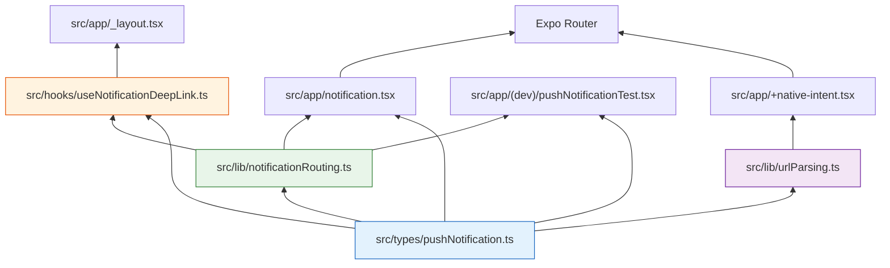
